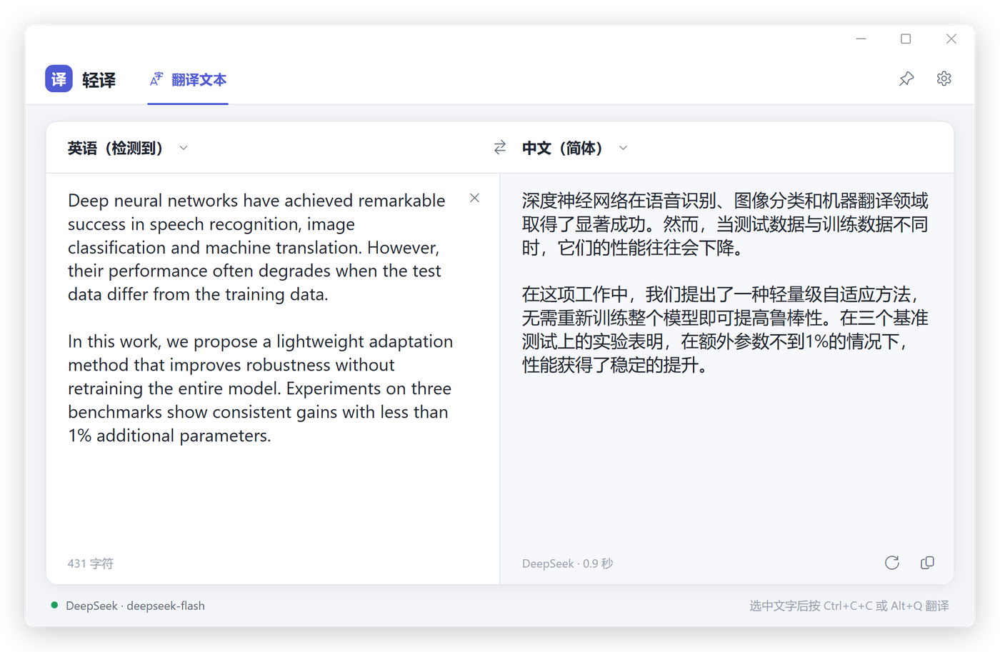
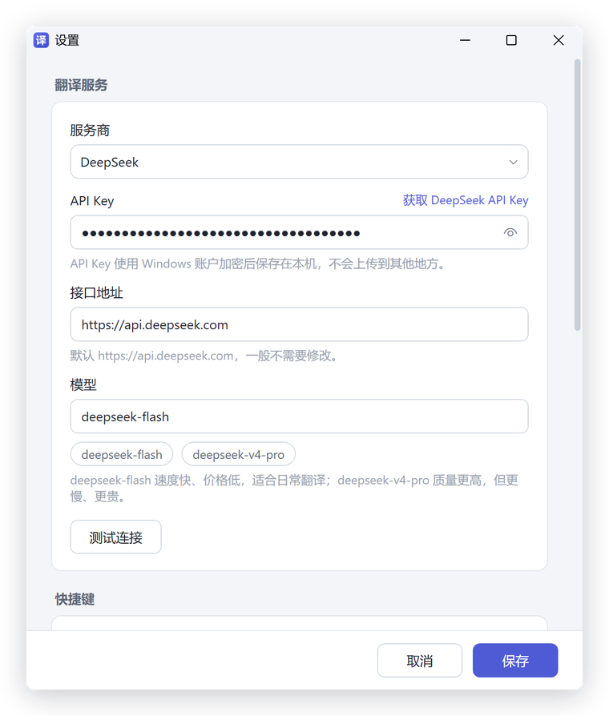

<div align="center">


# 轻译 QingYi Translator

**轻量级 Windows 中英翻译工具 · DeepL 平替**

在任意软件里选中文字，按两下 <kbd>Ctrl</kbd>+<kbd>C</kbd>，译文立刻出现。<br>
由 DeepSeek 等大模型驱动，用自己的 API Key 按量付费，日常翻译一段话通常不到 1 分钱。

[](https://github.com/Jingxuan-WH/QingYi-Translator/releases/latest)


[](LICENSE)

[**⬇️ 下载最新版**](https://github.com/Jingxuan-WH/QingYi-Translator/releases/latest) · [三分钟上手](#-三分钟上手) · [使用说明](#-使用说明) · [常见问题](#-常见问题) · [English](#english)



<sub>截图为 DeepSeek 的真实翻译结果，用时 0.9 秒</sub>

</div>

## ✨ 为什么用轻译

- **熟悉的 DeepL 式界面**：左边原文、右边译文，自动判断中英方向，译文逐字流式显示，打开就会用。
- **任意软件一键取词**：选中文字后按 <kbd>Ctrl</kbd>+<kbd>C</kbd>+<kbd>C</kbd>（和 DeepL 一样），或按自定义快捷键 <kbd>Alt</kbd>+<kbd>Q</kbd>。只要能用 Ctrl+C 复制文字的地方都能用：浏览器、PDF 阅读器、Office……
- **大模型翻译，译文更自然**：默认接入 DeepSeek，理解上下文和专业术语。还可以写一句"附加要求"，比如"使用学术论文的正式文风"。
- **专治 PDF 断行**：从论文 PDF 里复制出来、被硬换行切碎的句子（包括 `trans-lation` 这种断字），会自动拼成通顺的段落再翻译。
- **便宜，没有订阅**：用自己的 API Key 按量付费，没有月费，也没有字数额度。
- **不弄乱剪贴板**：用 Alt+Q 取词时，翻译完会把剪贴板恢复成原来的内容。
- **轻量、免安装**：单个 exe 约 400 KB，双击就能用；支持开机自启、托盘常驻、窗口置顶。
- **注重隐私**：API Key 用 Windows 账户加密后保存在本机；要翻译的文字只发给你选择的服务商；没有统计，没有广告。
- **完全开源**：MIT 许可证，代码随便看、随便改。

## 🚀 三分钟上手

### 1. 下载

到 [Releases](https://github.com/Jingxuan-WH/QingYi-Translator/releases/latest) 下载 `Translator.exe`，放进一个固定的文件夹（比如 `D:\Tools\QingYi\`），双击运行，不需要安装。

> [!NOTE]
> 轻译基于 .NET 10。如果电脑上还没有 [.NET 10 桌面运行时](https://dotnet.microsoft.com/download/dotnet/10.0)，第一次打开时会弹窗提示下载，按提示安装 **.NET Desktop Runtime（x64）** 即可，只需装一次。

### 2. 获取 DeepSeek API Key

1. 打开 [DeepSeek 开放平台](https://platform.deepseek.com/)，注册并登录。
2. 充值少量余额（几块钱就能用很久）。
3. 在 [API Keys](https://platform.deepseek.com/api_keys) 页面创建一个 Key 并复制。

### 3. 填入 Key

第一次启动时会自动弹出设置窗口：粘贴 API Key → 点「测试连接」→ 看到"连接成功"后点「保存」。



完成！去任意软件里选中一段文字，按两下 <kbd>Ctrl</kbd>+<kbd>C</kbd> 试试。

## 📖 使用说明

### 三种翻译方式

| 方式 | 怎么做 | 说明 |
|---|---|---|
| **Ctrl+C+C** | 选中文字，按住 <kbd>Ctrl</kbd> 连按两下 <kbd>C</kbd> | 和 DeepL 相同。复制是你自己按的，兼容性最好 |
| **快捷键取词** | 选中文字，按 <kbd>Alt</kbd>+<kbd>Q</kbd> | 程序替你复制，翻译完自动恢复剪贴板。没选中文字时直接打开窗口，再按一次隐藏 |
| **直接输入** | 在左侧输入或粘贴 | 停止输入约 0.7 秒后自动翻译，<kbd>Ctrl</kbd>+<kbd>Enter</kbd> 立即翻译 |

### 快捷键

| 快捷键 | 作用 |
|---|---|
| <kbd>Ctrl</kbd>+<kbd>C</kbd>+<kbd>C</kbd> | 翻译选中的文字（两次按 C 需在 0.5 秒内） |
| <kbd>Alt</kbd>+<kbd>Q</kbd> | 翻译选中的文字；窗口在前台时按下则隐藏窗口（可在设置中修改） |
| <kbd>Ctrl</kbd>+<kbd>Enter</kbd> | 立即翻译 / 重新翻译 |
| <kbd>Esc</kbd> | 隐藏窗口 |

### 语言方向

默认「检测语言」：输入中文就译成英文，输入英文就译成中文，夹着英文术语的中文也能正确识别。也可以在左上角手动指定源语言，或点中间的 ⇄ 交换方向（译文会变成新的原文，方便回译检查）。

### 托盘与窗口

- 点关闭按钮不会退出，而是缩到系统托盘，快捷键照常可用。
- 左键点托盘图标打开窗口；右键菜单可以打开设置或退出。
- 右上角的 📌 可以让窗口置顶，边读文献边翻译很方便。

### 设置项

| 设置 | 说明 |
|---|---|
| 服务商 / 模型 | 默认 DeepSeek `deepseek-flash`（快、便宜）；想要更高质量可以换 `deepseek-v4-pro` |
| 附加要求 | 追加给模型的翻译要求，例如"使用学术论文的正式文风；专业术语保留英文原文" |
| 快捷键 | 可以关闭 Ctrl+C+C，或把 Alt+Q 换成其他组合（需包含 Ctrl、Alt 或 Win）；设置页会提示快捷键是否已被其他程序占用 |
| 常规 | 输入时自动翻译、取词后恢复剪贴板、关闭时最小化到托盘、开机自动启动 |

### 使用其他大模型

在设置里把服务商切换为「自定义接口」，填写接口地址、模型名和 API Key，就能接入兼容 OpenAI 接口格式的服务，例如 Kimi、通义千问、智谱、硅基流动等。目前只在 DeepSeek 上做过完整测试，欢迎反馈其他服务的使用情况。

## ❓ 常见问题

<details>
<summary><b>按快捷键没有反应？</b></summary>

- 以**管理员身份**运行的程序里无法取词，这是 Windows 的安全限制。需要的话，可以把轻译也以管理员身份运行。
- 快捷键可能和其他软件冲突，例如 Office 里的 <kbd>Alt</kbd>+<kbd>Q</kbd> 是"告诉我"搜索框。可以在设置里换一个。
- Ctrl+C+C 的两次按 C 需要在 0.5 秒内完成。
</details>

<details>
<summary><b>提示"API Key 无效"或"余额不足"？</b></summary>

在设置里点「测试连接」检查。HTTP 401 表示 Key 填错了；402 表示 DeepSeek 账户余额不足，需要到开放平台充值。
</details>

<details>
<summary><b>翻译一次要花多少钱？</b></summary>

按 DeepSeek 官方[价格](https://api-docs.deepseek.com/quick_start/pricing)计费（以官网为准）。日常划词翻译一段话通常不到 1 分钱。
</details>

<details>
<summary><b>我的文字和 API Key 安全吗？</b></summary>

- API Key 用 Windows DPAPI 加密后保存在 `%APPDATA%\QingYiTranslator\settings.json`，只有你当前的 Windows 账户能解密。
- 要翻译的文字只发送给你配置的翻译服务（默认 DeepSeek）。轻译没有自己的服务器，不收集任何数据。
- 为了识别 Ctrl+C+C，程序使用了系统键盘钩子，但只判断 C 键和 Ctrl/Alt/Win 键的状态，不记录任何按键内容，代码见 [`Platform/DoubleCopyHook.cs`](Platform/DoubleCopyHook.cs)。
</details>

<details>
<summary><b>杀毒软件报毒？</b></summary>

程序没有数字签名，又用到了取词所需的键盘钩子和模拟按键，个别杀毒软件可能误报。代码完全开源，你也可以按下文自己编译。
</details>

<details>
<summary><b>怎么卸载？</b></summary>

先在设置里关闭「开机自动启动」，再右键托盘图标退出，然后删除 `Translator.exe` 和 `%APPDATA%\QingYiTranslator` 文件夹即可。
</details>

## 🛠️ 从源码构建

需要 Windows 10/11 和 [.NET 10 SDK](https://dotnet.microsoft.com/download/dotnet/10.0)：

```bash
git clone https://github.com/Jingxuan-WH/QingYi-Translator.git
cd QingYi-Translator
dotnet publish -c Release -r win-x64 --self-contained false -p:PublishSingleFile=true -p:DebugType=None -o publish
```

生成的程序在 `publish/Translator.exe`。

<details>
<summary>项目结构</summary>

```
├── App.xaml(.cs)              启动、单实例、托盘、快捷键调度
├── Core/
│   ├── TranslationClient.cs   OpenAI 兼容接口的流式翻译客户端（SSE）
│   ├── AppSettings.cs         设置读写、API Key 加密（DPAPI）
│   └── Lang.cs                中英文自动识别
├── Platform/
│   ├── DoubleCopyHook.cs      Ctrl+C+C 检测（低级键盘钩子，独立线程）
│   ├── GlobalHotkey.cs        全局快捷键（RegisterHotKey）
│   ├── SelectionReader.cs     取词：模拟复制 + 剪贴板备份与恢复
│   └── ...                    托盘图标、窗口位置记忆、开机自启等
├── Views/                     主窗口、设置窗口（WPF）
└── Themes/Styles.xaml         界面样式
```
</details>

## 🗺️ 计划

- [ ] 文档翻译（Word / PDF）
- [ ] 更多服务商预设（Kimi、通义千问、Claude 等）
- [ ] 深色模式
- [ ] 翻译历史与术语表

有问题或建议欢迎提 [Issue](https://github.com/Jingxuan-WH/QingYi-Translator/issues)。如果轻译对你有帮助，请点个 ⭐ Star，让更多人看到它！

## 📄 许可证与声明

- 本项目基于 [MIT 许可证](LICENSE) 开源。
- 界面设计参考了 DeepL 翻译器。本项目与 DeepL SE 没有任何关联；"DeepL" 是 DeepL SE 的商标，"DeepSeek" 是其所有者的商标。

---

## English

**QingYi (轻译)** is a lightweight Chinese ↔ English translator for Windows — a DeepL-style alternative powered by large language models (DeepSeek by default).

- **Translate anywhere** — select text in any app and press <kbd>Ctrl</kbd>+<kbd>C</kbd> twice (just like DeepL), or press <kbd>Alt</kbd>+<kbd>Q</kbd>.
- **Familiar UI** — a DeepL-like two-pane window with automatic language detection and streaming output.
- **Fixes PDF line breaks** — sentences broken across lines (and hyphenated words) are joined before translation.
- **Pay as you go** — bring your own DeepSeek API key, or any OpenAI-compatible endpoint. No subscription.
- **Tiny and portable** — a single ~400 KB exe (needs the [.NET 10 Desktop Runtime](https://dotnet.microsoft.com/download/dotnet/10.0)), with tray icon, autostart and always-on-top.
- **Private** — your API key is encrypted with Windows DPAPI; text goes only to the provider you configure.

**Quick start:** download `Translator.exe` from [Releases](https://github.com/Jingxuan-WH/QingYi-Translator/releases/latest), run it, paste your [DeepSeek API key](https://platform.deepseek.com/api_keys) into the settings window, click 「测试连接」 (Test connection), then 「保存」 (Save). The interface is in Chinese.

**Build from source:** install the .NET 10 SDK and run the `dotnet publish` command shown above.

Licensed under MIT. Not affiliated with DeepL SE.
